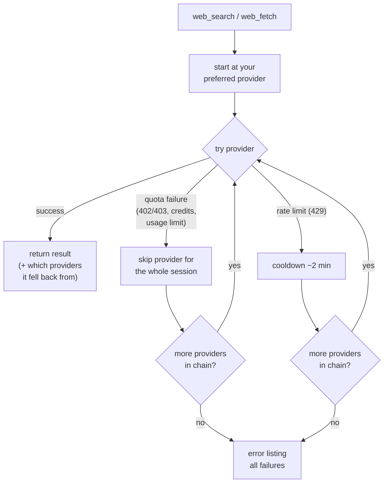

# @tian.zuo/pi-web-search

Web search and web fetch for the [pi coding agent](https://pi.dev). Two tools,
seven providers plus a built-in keyless fetcher, automatic fallback — no single
point of failure. **Works with zero configuration** thanks to Firecrawl's
keyless tier (search + fetch, no signup).

> **Token-light by design.** The whole extension adds **196 characters** of
> model-facing text — two tool descriptions of one sentence each. For
> comparison, [pi-web-access](https://www.npmjs.com/package/pi-web-access)
> spends ≈3,200 characters on its `web_search` tool alone (1,853-char
> description + parameter guidance) — **~16× our entire prompt surface**, across
> 4 tools vs our 2. All the routing intelligence (fallback orders, keyless
> ladders, quota handling) lives in extension code, not in the prompt, so the
> model spends its attention on your code instead of reading tool manuals.

## Configuration

**Easiest — `/websearch-auth` + `/websearch-order`** inside a pi session.

`/websearch-auth`: pick a provider, paste your key, done — or skip it
entirely: keyless Firecrawl is the default, no key needed.

```text
 Configure provider:

 → openai    ✓ auto: pi login (openai-codex)
   exa       • unconfigured
   firecrawl ✓ keyless (1,000 free credits/mo)
   tavily    • unconfigured
   monid     • unconfigured
   ollama    • unconfigured (default localhost:11434)
```

`/websearch-order`: configure both fallback chains in one dialog. It opens on
**Search**; press `tab` to switch to **Fetch**. Grab a provider with `enter`,
move it with `↑↓`, press `space` to drop it, and use `enter` while grabbed to
save both tabs. `esc` cancels all edits.

```text
 Web provider order

  Search   Fetch    Tab switches tool

 ↑↓ navigate • enter grab • tab switch • esc cancel

 → openai    ✓ ~/.pi/agent/auth.json (openai-codex)
   exa       ✓ EXA_API_KEY env
   firecrawl ✓ FIRECRAWL_API_KEY env (overflow after keyless credits)
   ollama    ✓ default localhost
   tavily    • unconfigured
   monid     • unconfigured
```

The Fetch tab uses the same controls and includes `direct`, the built-in HTTP
fallback. The default chains still apply when you do not save a custom order.

**Manual** — env variables:

| Variable                         | Unlocks                                                                                                                                    |
| :------------------------------- | :----------------------------------------------------------------------------------------------------------------------------------------- |
| `OPENAI_API_KEY`                 | OpenAI search — your pi Codex/OpenAI login is used first; this key is only a fallback                                                      |
| `DEEPSEEK_API_KEY`               | DeepSeek search (server-side `web_search`) — your pi DeepSeek login is used first; this key is only a fallback                             |
| `EXA_API_KEY`                    | Exa search + fetch                                                                                                                         |
| `FIRECRAWL_API_KEY`              | Firecrawl search + fetch — optional: without a key, the keyless tier is used (1,000 free credits/mo; set `FIRECRAWL_KEYLESS=0` to disable) |
| `TAVILY_API_KEY`                 | Tavily search **and** fetch — one key unlocks both tools (fetch uses Tavily Extract)                                                       |
| `MONID_API_KEY`                  | Monid search + fetch — TinyFish endpoints via api.monid.ai, $0/call                                                                        |
| `OLLAMA_HOST` / `OLLAMA_API_KEY` | Ollama (default `http://localhost:11434`)                                                                                                  |

…or `~/.pi/web-search.json` for non-secret options. Every key is optional — omit
what you don't need:

A maximal example (defaults shown for `searchOrder`/`fetchOrder` are just
illustration — the real default is the canonical order filtered by what's
credentialed):

```json
{
  "searchProvider": "exa",
  "fetchProvider": "firecrawl",
  "searchOrder": ["tavily", "exa", "firecrawl"],
  "fetchOrder": ["exa", "tavily", "direct"],
  "openai": {
    "model": "gpt-5.6-luna",
    "baseUrl": "https://api.openai.com/v1/responses",
    "systemPrompt": "Search the web. Answer concisely and accurately; cite sources with Markdown links.",
    "reasoning": "low"
  },
  "deepseek": {
    "model": "deepseek-v4-flash",
    "baseUrl": "https://api.deepseek.com/responses",
    "reasoning": "low"
  },
  "exa": { "baseUrl": "https://api.exa.ai" },
  "firecrawl": { "baseUrl": "https://api.firecrawl.dev/v2", "keyless": true },
  "tavily": { "baseUrl": "https://api.tavily.com" },
  "ollama": { "baseUrl": "http://localhost:11434" },
  "monid": { "baseUrl": "https://api.monid.ai" }
}
```

`openai.reasoning` is optional: without it the search call follows the
session's thinking level (via pi's model registry), falling back to the model
default; set `"low"` to always search ~40% faster. `deepseek.reasoning`
defaults to `"low"` already (agentic server-side search; `"none"` disables
thinking entirely).

Prefer the interactive route? `/websearch-order` writes complete `searchOrder`
and `fetchOrder` arrays for you; use `tab` to switch between them.
`/websearch-auth` manages Ollama's base URL — no hand-editing needed.

## Commands

| Command            | Description                                                                                                                                                                 |
| :----------------- | :-------------------------------------------------------------------------------------------------------------------------------------------------------------------------- |
| `/web-search`      | Show provider status: detected credentials (incl. auto-detected OpenAI) and the active search/fetch fallback chains                                                         |
| `/websearch-order` | Interactively reorder search and fetch fallback chains: tab switch • enter grab • ↑↓ move • enter save • esc cancel (saved as `searchOrder` and `fetchOrder`)                        |
| `/websearch-auth`  | Interactive credential setup (DeepSeek / Exa / Firecrawl / Tavily / Monid / Ollama). OpenAI is listed read-only — it's auto-detected from your pi `/login` (Codex) or `OPENAI_API_KEY` |
| `/websearch-usage` | Show this session's per-provider usage (calls, failures, avg latency), providers on cooldown/blocked, and your Monid wallet balance with recent run costs                   |

## The tools

### `web_search`

Queries live web sources and returns ranked results with links and snippets.
OpenAI, DeepSeek, and Tavily additionally return a synthesized summary (shown
as `## Summary`).

- **Firecrawl** (default): live SERP results, keyed or keyless (1,000 free
  credits/mo without a key; `FIRECRAWL_KEYLESS=0` to opt out).
- **OpenAI**: server-side web search via the Responses API with a simple prompt;
  uses your active pi login (`openai-codex` / `openai`) first, falling back to
  `OPENAI_API_KEY`.
- **DeepSeek**: server-side `web_search` tool on DeepSeek's Responses API —
  agentic multi-round search with page reads and a synthesized answer. Uses
  your pi DeepSeek login first, then `DEEPSEEK_API_KEY`. Slow (~15–40s) but
  cheap; domain filters are not supported by the upstream tool.
- **Exa / Tavily / Firecrawl / Monid / Ollama**: native API calls. Exa, Tavily,
  Firecrawl, and Monid keys each power **both** search and fetch.
- **Monid** (TinyFish via [api.monid.ai](https://monid.ai), $0/call):
  browser-rendered search — never-cached results with snippets and dates.

### `web_fetch`

Reads web pages and PDFs as clean Markdown/text. To customize its fallback
priority, open `/websearch-order` and press `tab` to switch from Search to
Fetch.

- **Firecrawl** (`/v2/scrape`, `onlyMainContent` on): keyed or
  [keyless](https://www.firecrawl.dev/blog/firecrawl-keyless-launch) — a real
  browser renders the page, so it succeeds where plain HTTP clients are
  bot-blocked or starved of JavaScript. **Exa** (`/contents`), **Tavily**
  (`/extract`, markdown format), **Monid** (TinyFish `/fetch`: real-browser
  rendering, clean Markdown), **Ollama** (`/api/web_fetch`): native scrapers.
- **Direct fetch** (the keyless fallback): plain HTTP GET, then main-content
  extraction with [Defuddle](https://github.com/kepano/defuddle) (the engine
  behind Obsidian Web Clipper) — navigation, sidebars, and cookie banners are
  removed before Markdown conversion. If Defuddle finds no usable main content
  (SPAs, tiny fragments), it falls back to a built-in regex-based converter.
  Pass `raw: true` to get the untouched response body instead.
- **PDFs**: `.pdf` URLs start at `direct`, which extracts the embedded text
  layer locally with [unpdf](https://github.com/unjs/unpdf) (free, no credits;
  up to 20MB / 100 pages — override with `maxPages`). Pages are delimited by
  `<!-- Page N -->` markers. When `maxPages` cuts a document short, the
  complete extraction is written to `~/.pi/web-search/fetches/` and the
  inline answer points at the file; extractions over ~200K chars are always
  persisted that way with a short preview inline.
  Scanned PDFs without a text layer fall through the chain to Firecrawl,
  whose `auto` parser mode applies OCR.
- **Raw text files**: plain-text document, data/config, and source-file URLs
  (`.md`, `.txt`, `.json`, `.yaml`, `.csv`, `.py`, `.ts`, … — deliberately not
  server-page suffixes like `.php`) also start at `direct`, which returns
  `text/*` bodies verbatim: no scraper credits, no reformatting. Explicit
  `fetchProvider`/`fetchOrder` settings disable the direct-first reordering
  for both cases.

## License

MIT

## Workflow



## Release notes

[changelog](https://github.com/TianZuo555/pi-extensions/blob/main/packages/pi-web-search/CHANGELOG.md)
· [GitHub releases](https://github.com/TianZuo555/pi-extensions/releases)
