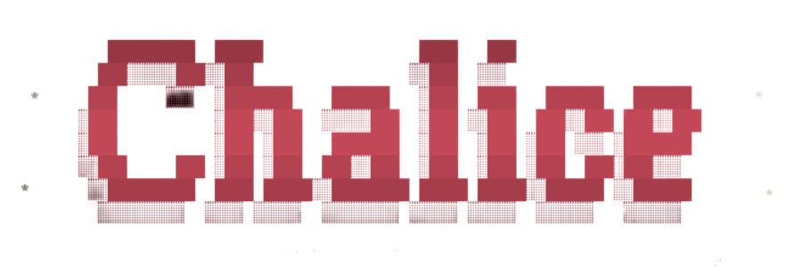

# Chalice

**Chalice** is a verification-first coding agent: it's goal is to ship changes with evidence that it works.

  

Nowadays, a lot (most) of the mainstream agent harnesses are all going for autonomy / autonomous agentic workflows, while most people still stick to the prompt --> edit --> answer model.

Chalice isn't going for autonomy or an agentic workflow. It's going for the same typical prompt edit workflow, except _it's goal is to aid in verifying implementation as cleanly as possible_

> 63% of technologists rarely or never let agents run on autopilot, and 68% prefer single agents setups. If I were to be considered a technologist, I would be part of that 68%.

# Installation

You're. Early. (How did you find the repo?)

# Features

> Chalice by default is a fork of Pi under the hood, and also uses several user extensions.

All the usual stuff; (MCP Servers, Sessions, Hashline based editing, 50+ providers, Model discovery, AGENTS.md in context (no nested support), steering, and more)

- A verification first workflow
- Confidence score (based on lsp errors, test results, agent opinion, criterias met (/goal))
- LSP aware edits
- Modes: press `Tab` to cycle through **Change** (default tools), **Think** (read-only tools), and **Review** (all default tools except `edit` and `write`). Verify mode is planned but not enabled yet.
- Goal tracking (/goal)
- A FIRE appearance (somewhat literally) (Why does everybody ignore the looks?).
- /test (true / false toggle, if true, agent will always attempt to make up a test to verify more effectively.)

Since Chalice is also based on Pi, you can always easily add extensions!

# Credits

Chalice uses Pi and several other user repos, see [CREDITS.md](CREDITS.md)
