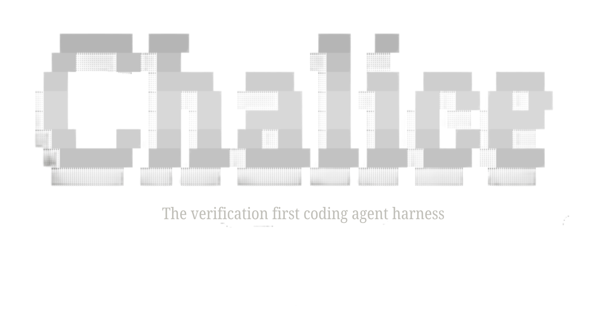

  

  

Nowadays, a lot (most) of the mainstream agent harnesses are all going for autonomy / autonomous agentic workflows, while most people still stick to the prompt --> edit --> answer model.

Chalice isn't going for autonomy or an agentic workflow. It's going for the same typical prompt edit workflow, except _it's goal is to aid in verifying implementation as cleanly as possible_

> 63% of technologists rarely or never let agents run on autopilot, and 68% prefer single agents setups. If I were to be considered a technologist, I would be part of that 68%.

# Installation

clone the repo, then: 

npm run install:global

to launch the app, run "chalice" anywhere (chalice --help for some parameter options but these are mostly the things that come with Pi)

# Features

> Chalice is a fork of Pi with application features and selected user extensions built in.

All the usual stuff; (MCP Servers, Sessions, Anchor based editing, TODOs, Web search tools, 50+ providers, Model discovery, AGENTS.md in context (no nested support), steering, and more)

Actual features / things you don't see often in other agent harnesses:

- Semantic File Indexing
- LSP aware edits
- Modes: press `Tab` to cycle through **Change** (default tools), **Think** (read-only tools), and **Review** (all default tools except `edit` and `write`).
- Goal tracking (/goal)
- Test method tracking (/testprompt or TESTMETHODS.md in project)

Since Chalice is also based on Pi, you can always easily add extensions!

# Credits

Chalice is made by leolastforce
Chalice uses Pi and several other user repos, see [CREDITS.md](CREDITS.md)
